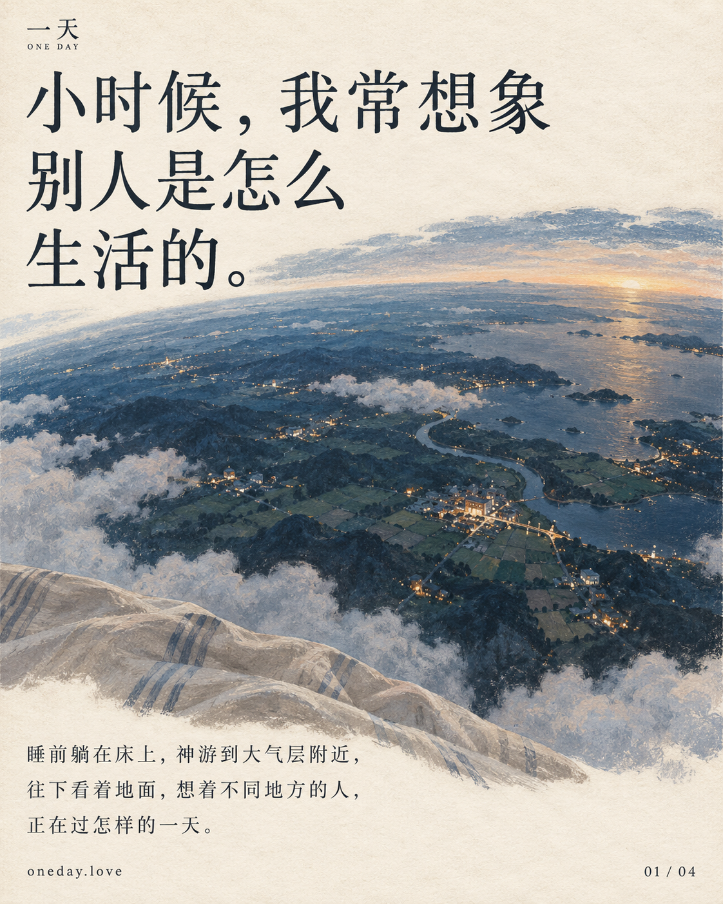
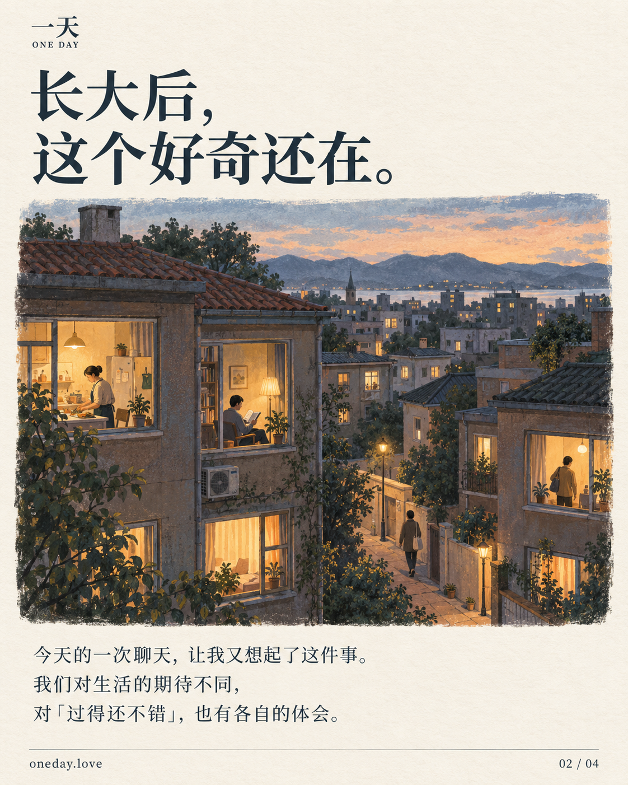
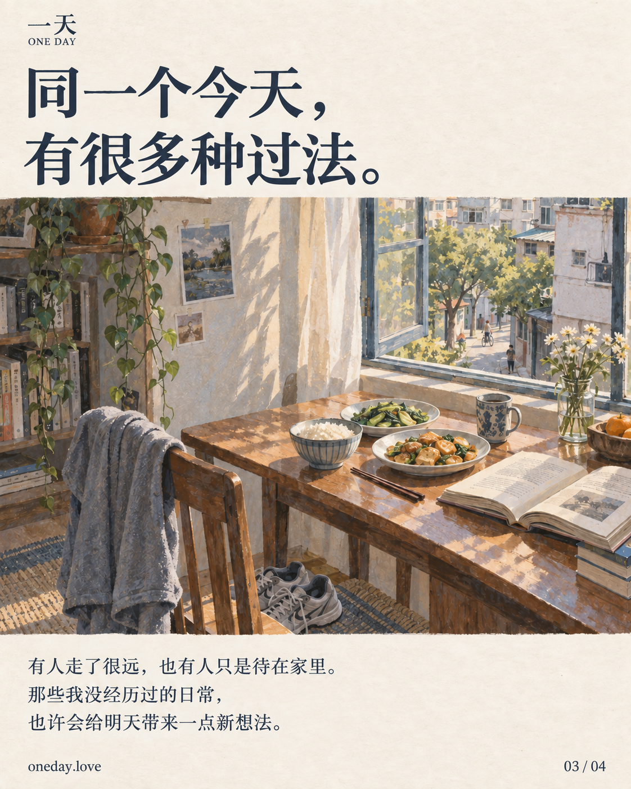
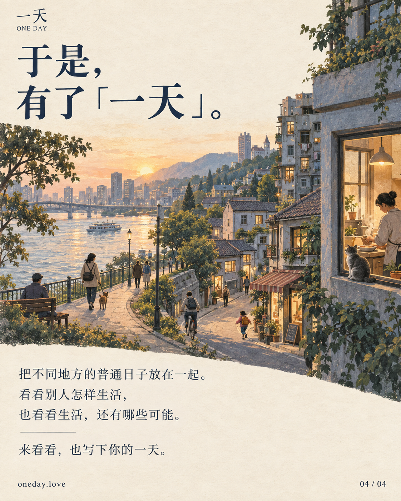

# 一天 · One Day

**看看别人怎样生活，也看看生活还有哪些可能。**

[打开 oneday.love](https://oneday.love/) · [备用地址](https://oneday-bice.vercel.app/) · [提出想法](https://github.com/echoLifeOvO/oneday/issues) · [English](#in-english)

一天是一个免费的匿名生活记录网站。不同地方的人，在这里写下自己的一天、当天的花费，以及自己的感受。

## 为什么做“一天”

小时候，我睡前有个固定活动：躺在床上，神游天外。想象自己到了大气层附近，往下看着地面，想着不同地方的人正在怎样生活。

长大以后，这个好奇还在。有时假期待在家里，觉得无聊，我也会想：别人今天是怎么过的？

最近的一次聊天，又让我想起了这件事。我们对生活的期待不同，对什么叫“过得还不错”，也有各自的体会。我想更具体地看看这些不同。

所以，有了“一天”。

这里像一间收集普通日子的博物馆。有人上班、做饭，有人旅行、散步，也有人只是待在家里。做了什么，花了多少，今天感觉怎样，都可以留下来。

我希望它能让大家看到更多生活的可能。那些自己没经历过的日常，也许会给明天带来一点新想法。

## 这个想法的由来

| 小时候的想象 | 长大后的好奇 |
| :---: | :---: |
|  |  |
| **不同的过法** | **于是，有了一天** |
|  |  |

四张图讲的是这个项目的起点。插画是想象中的生活场景，不是真实人物或住所的照片。点击图片可查看原图。[制作说明](docs/promo/README.md)

## 在这里，可以做什么

- **看看别人的一天。** 转动地球，或搜索一个地方。有日记的地区会一直亮着，靠近后可以打开当地的记录；点一条流过屏幕的弹幕，也能直接走进那个人的一天。地区里可以查看不同日期的日记，点开卡片后左右切换。
- **留下自己的一天。** 写一段最多 200 字的记录，自行选择县市或城镇，填上这一天大概的花费、币种，以及 0–100 分的个人感受。没有标题，日期自动使用发布当天。
- **公开聊两句。** 无需注册或登录，每次发布使用随机名字。可以公开留言，没有私聊。

分数只是记录者当天的主观感受。普通的一天也可以写，不需要先发生什么特别的事。

网站支持中英文界面和手机浏览。日记地点由你自己选择，不读取 GPS；地球首次朝向可能参考请求 IP 的大致区域。日记与留言通过内容审核后发布，更多说明见[特别声明](https://oneday.love/sources)。

## 一起把它做得更好

如果你觉得哪里不好用，或者想到一种更有意思的玩法，欢迎[提一个 Issue](https://github.com/echoLifeOvO/oneday/issues)。不必会写代码，像产品经理一样说说你的想法、遇到的问题，以及为什么想改就行。

也欢迎 Fork 后提交 PR。由我来维护和合并主分支，大家通过 Issue 和 PR 一起参与。具体见[参与说明](CONTRIBUTING.md)。

联系作者：[X · @echolifeovo](https://x.com/echolifeovo) · [echoLifeOvO@gmail.com](mailto:echoLifeOvO@gmail.com)

## In English

**See how others live, and discover more possibilities for your own day.**

As a child, I had a bedtime habit: lying in bed, I would imagine looking down at Earth from near the edge of the atmosphere, wondering how people in other places were living.

That curiosity stayed with me. A recent conversation reminded me that people have different expectations of life and different ideas of what a good day feels like. I wanted to see those differences through ordinary, concrete days.

So I made One Day: a free, anonymous collection of everyday lives. Some people work, cook or travel; others go for a walk or simply stay at home. A day you have never experienced might give you a new idea for tomorrow.

Explore the globe, search a town, or click a passing diary. Share up to 200 characters with a chosen location, daily spending, currency, and a personal score from 0 to 100. The date is set to today. No account is needed; each post gets a random nickname. Conversations happen through public comments, with no private messaging. The interface supports Chinese and English, including mobile browsers.

Ideas are welcome in [Issues](https://github.com/echoLifeOvO/oneday/issues), even if you do not code. You can also fork the repository and open a PR; the maintainer reviews and merges contributions.
